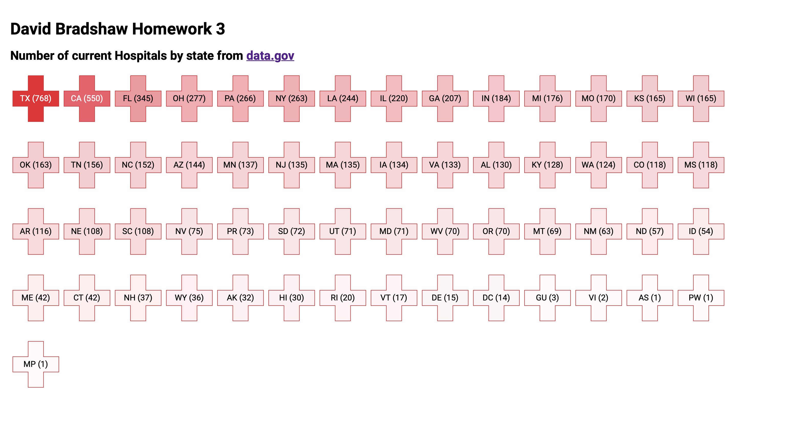

# David Bradshaw Programming Visualization Fall 2020 Class

This is the repo for the programming vis class for Fall 2020 at pratt.

## Homework 2

Homework two assignment.  Draws bar graph based on [CSV data](src/data.csv) from American Express for 2019 Credit Card spending.  Hover over bars to see total for that month. source code can be seen in [script.js](src/script.js).  Screenshot can be found here:



------------

## Getting started

This is a basic webpage.  Copy content of `src` onto a web server.  This project also includes a basic http server to run the site for development purposes.  To get started with this setup run `npm install` and then `npm run start` to run the server.  The server setup with this app has caching turned off to ensure latest code changes are seen. This is not optimal for a production setup.

## Running

```bash
# Start local server hosting files, normally runs on port 8080 on localhost.
npm run start

# Open the proper URL in the default browser and start the server.
npm run dev
```
