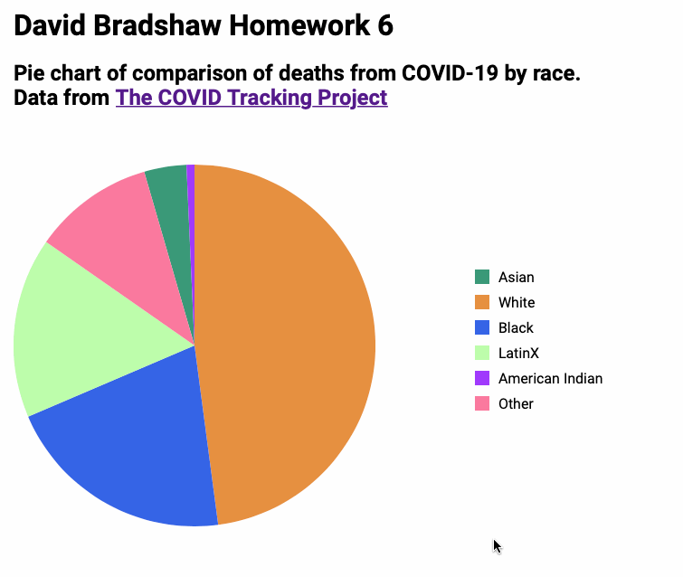

# David Bradshaw Programming Visualization Fall 2020 Class

This is the repo for the programming vis class for Fall 2020 at pratt.

## Homework 5

Homework five assignment, source code can be seen in [script.js](src/script.js).  This graph shows the temperature ranges for the last since January 1, 2000.  It uses a standard color reference of temperature to visually show cold and hot while still having the left ticks explain the exact temperature. This takes the work from Homework 4 and adds interactivity to it with a slider that changes the date (filters) and a hover that shows the data of each point.  Animated GIF can be found here:



If GIF does not play; [click here to view it directly](example.gif)

------------

## Getting started

This is a basic webpage.  Copy content of `src` onto a web server.  This project also includes a basic http server to run the site for development purposes.  To get started with this setup run `npm install` and then `npm run start` to run the server.  The server setup with this app has caching turned off to ensure latest code changes are seen. This is not optimal for a production setup.

## Running

```bash
# Start local server hosting files, normally runs on port 8080 on localhost.
npm run start

# Open the proper URL in the default browser and start the server.
npm run dev
```
